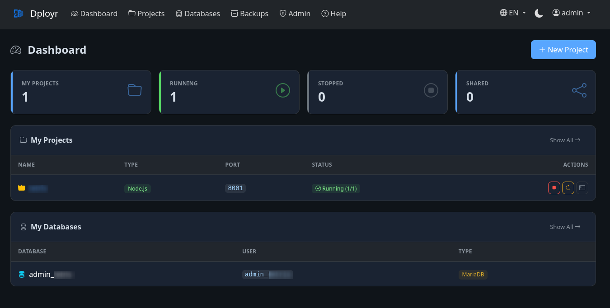
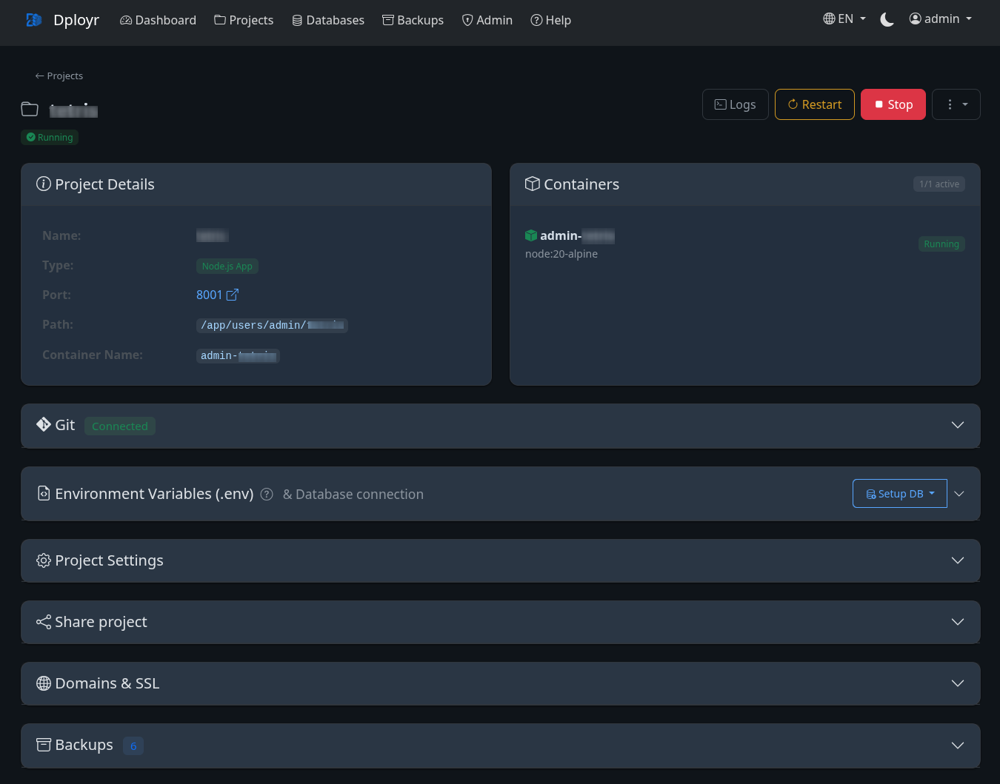
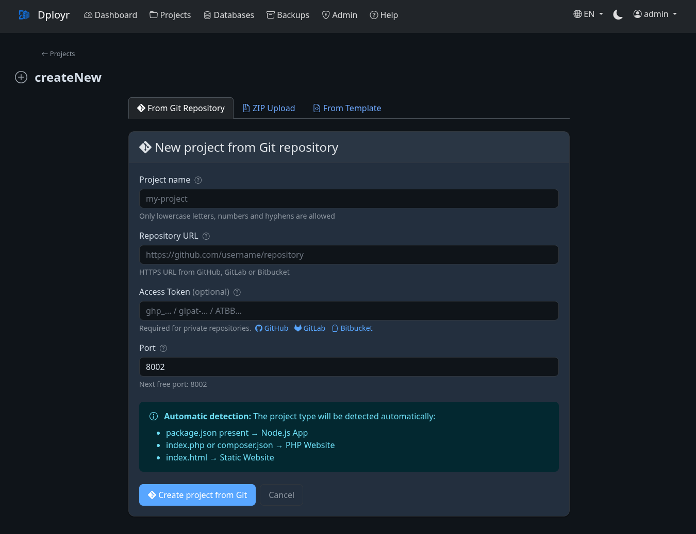
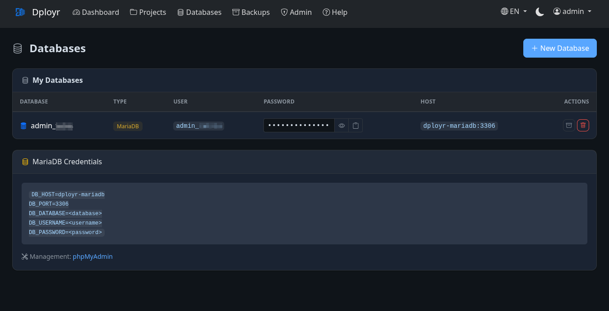
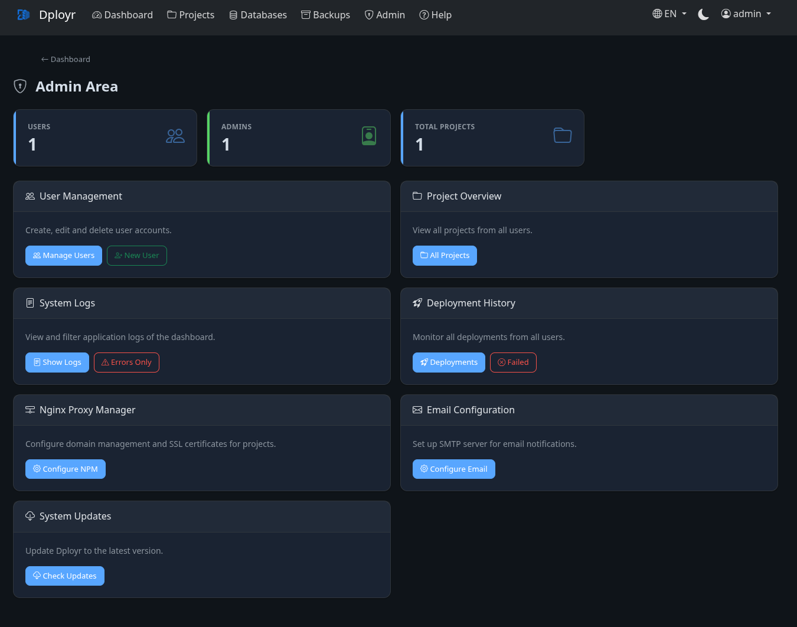
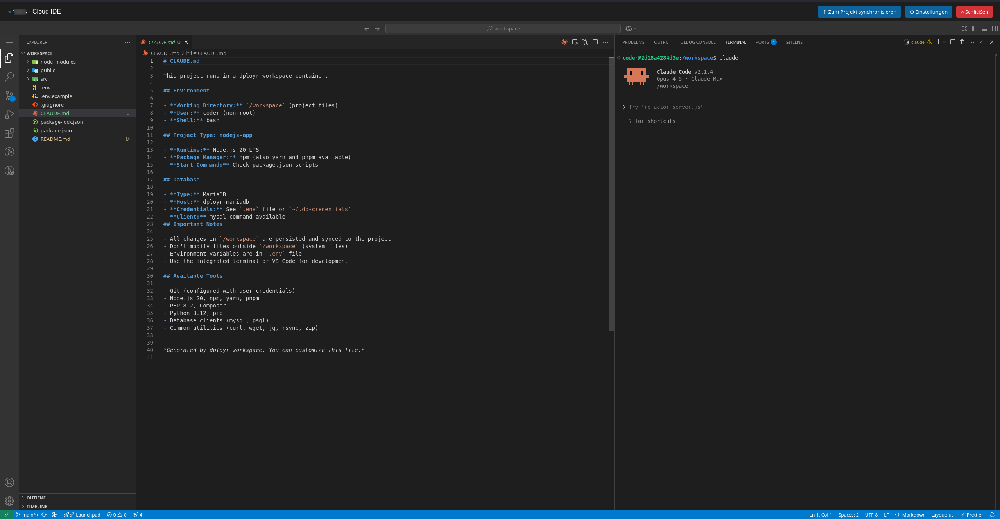
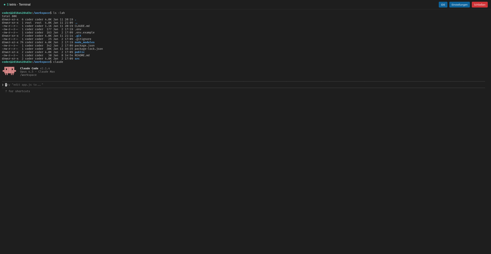

<p align="center">
  
</p>

<h1 align="center">Dployr</h1>

<p align="center">
  <strong>Docker-based multi-user hosting platform for web projects</strong>
</p>

<p align="center">
  <a href="https://github.com/Flexomatic81/dployr/releases/latest"></a>
  <a href="https://github.com/Flexomatic81/dployr/blob/main/LICENSE"></a>
  <a href="https://github.com/Flexomatic81/dployr/issues"></a>
  <a href="https://github.com/Flexomatic81/dployr/stargazers"></a>
</p>

<p align="center">
  <a href="#-quick-start">Quick Start</a> •
  <a href="#-features">Features</a> •
  <a href="#-documentation">Documentation</a> •
  <a href="CHANGELOG.md">Changelog</a> •
  <a href="#-contributing">Contributing</a>
</p>

---

Deploy and manage isolated web projects on a shared Linux server through an intuitive web dashboard. Supports automatic project type detection, Git integration with webhooks, database provisioning, backups, and more.

## Table of Contents

- [Features](#-features)
- [Screenshots](#-screenshots)
- [Quick Start](#-quick-start)
- [Services](#-services)
- [Documentation](#-documentation)
  - [Creating Projects](#creating-projects)
  - [Managing Projects](#managing-projects)
  - [Workspaces (Cloud IDE)](#workspaces-cloud-ide)
  - [Databases](#databases)
  - [Auto-Deploy & Webhooks](#auto-deploy--webhooks)
  - [Project Sharing](#project-sharing)
  - [Domains & SSL](#domains--ssl)
  - [Backup & Restore](#backup--restore)
  - [System Updates](#system-updates)
  - [Email Notifications](#email-notifications)
- [Configuration](#-configuration)
- [Project Type Detection](#-project-type-detection)
- [CLI Scripts](#-cli-scripts)
- [Directory Structure](#-directory-structure)
- [Security](#-security)
- [Contributing](#-contributing)
- [License](#-license)

## ✨ Features

### Core Features

| Feature | Description |
|---------|-------------|
| 🖥️ **Web Dashboard** | Browser-based project management with dark/light theme |
| 🚀 **Multiple Deployment Methods** | Git repository, ZIP upload, or empty template |
| 🔄 **Auto-Deploy** | Automatic updates via polling or webhooks |
| 🔍 **Smart Detection** | Automatically detects Static, PHP, Node.js, Laravel, Next.js, Nuxt.js, Python |
| 🐳 **Custom Docker-Compose** | Deploy your own multi-container environments with security validation |
| 🗄️ **Database Support** | MariaDB and PostgreSQL with phpMyAdmin & pgAdmin |
| 👥 **Multi-User** | User registration with admin approval workflow |
| 🔗 **Project Sharing** | Share projects with other users (read/manage/full access) |

### Advanced Features

| Feature | Description |
|---------|-------------|
| 💻 **Cloud IDE (Workspaces)** | VS Code in the browser with Claude Code AI integration |
| 🖥️ **Terminal Access** | Real-time WebSocket terminal for workspace containers |
| 📝 **Environment Editor** | Edit .env files directly in the browser |
| 🌐 **Custom Domains & SSL** | Connect domains with free Let's Encrypt certificates |
| 💾 **Backup & Restore** | Manual backups for projects and databases |
| 📧 **Email Notifications** | Deployment success/failure notifications |
| 🔔 **Webhooks** | Instant deployments from GitHub, GitLab, Bitbucket |
| ⬆️ **System Updates** | One-click updates from the dashboard |

## 📸 Screenshots

<details>
<summary><b>Dashboard</b> - Main overview with project and database status</summary>
<p align="center">
  
</p>
</details>

<details>
<summary><b>Project Details</b> - Manage containers, environment, sharing, and backups</summary>
<p align="center">
  
</p>
</details>

<details>
<summary><b>Git Deployment</b> - Create projects from Git repositories with auto-detection</summary>
<p align="center">
  
</p>
</details>

<details>
<summary><b>Databases</b> - MariaDB and PostgreSQL management with credentials</summary>
<p align="center">
  
</p>
</details>

<details>
<summary><b>Domains & SSL</b> - Nginx Proxy Manager integration</summary>
<p align="center">
  
</p>
</details>

<details>
<summary><b>Admin Panel</b> - User management, logs, and system settings</summary>
<p align="center">
  
</p>
</details>

<details>
<summary><b>Workspace IDE</b> - VS Code in the browser with Claude Code</summary>
<p align="center">
  
</p>
</details>

<details>
<summary><b>Workspace Terminal</b> - Real-time terminal access</summary>
<p align="center">
  
</p>
</details>

## 🚀 Quick Start

### Requirements

| Component | Minimum Version |
|-----------|-----------------|
| **Linux** | Any distribution |
| **Docker** | 20.10+ |
| **Docker Compose** | v2.0+ |
| **Git** | 2.0+ |

### Installation

```bash
# 1. Clone repository
git clone https://github.com/Flexomatic81/dployr.git /opt/dployr
cd /opt/dployr

# 2. Create configuration
cp .env.example .env
nano .env  # Set passwords!

# 3. Start everything
docker compose up -d

# 4. Open browser → Setup Wizard
# http://<SERVER_IP>:3000/setup
```

The setup wizard guides you through creating the first admin user.

## 📦 Services

After startup, the following services are available:

| Service | Port | Purpose |
|---------|------|---------|
| **Dashboard** | 3000 | Web interface |
| **MariaDB** | 3306 | MySQL-compatible database |
| **PostgreSQL** | 5432 | Advanced database |
| **phpMyAdmin** | 8080 | MariaDB management |
| **pgAdmin** | 5050 | PostgreSQL management |
| **NPM** | 80, 443, 81 | Domain proxy & SSL (optional) |

## 📖 Documentation

### Creating Projects

The dashboard offers three ways to create a project:

#### Git Repository (recommended)
- Enter repository URL (HTTPS)
- For private repos: Add a personal access token
- Project type is automatically detected
- Use "Pull" button, Auto-Deploy, or Webhooks for updates

#### ZIP Upload
- Upload a ZIP file (max 100 MB)
- Automatic extraction and type detection
- Nested folders are automatically flattened

#### Empty Template
- Choose a project type (Static, PHP, Node.js, Python)
- Start with a blank project structure

#### Custom Docker-Compose (Advanced)

Deploy projects with your own `docker-compose.yml` for full control over the container environment.

**How it works:**
1. Include a `docker-compose.yml` in your Git repository root
2. Dployr automatically detects and processes it
3. Your services are validated, secured, and deployed

**Automatic transformations:**
- Container names are prefixed with your username
- Ports are remapped to available external ports
- All services join the Dployr network
- Resource limits are enforced (default: 1 CPU, 512MB RAM per service)
- Database volumes are isolated from app files

**Supported services:**
- Web servers (Nginx, Apache, Caddy)
- Databases (MySQL, PostgreSQL, MongoDB, Redis)
- Build tools and custom images
- Multi-container applications

**Security restrictions:**
- No privileged containers
- No host network mode
- No Docker socket mounts
- No access to system directories (`/etc`, `/root`, `/proc`)

**Example docker-compose.yml:**
```yaml
version: '3.8'
services:
  app:
    build: .
    ports:
      - "3000:3000"
    environment:
      - NODE_ENV=production
    depends_on:
      - db

  db:
    image: postgres:15-alpine
    environment:
      - POSTGRES_DB=myapp
      - POSTGRES_USER=app
      - POSTGRES_PASSWORD=secret
    volumes:
      - pgdata:/var/lib/postgresql/data

volumes:
  pgdata:
```

After deployment, the project detail page shows all services with their status, ports, and detected technologies.

### Managing Projects

From the project detail page you can:

- **Start/Stop/Restart** containers
- **View logs** in real-time
- **Pull** latest changes from Git
- **Edit .env** environment variables
- **Configure database** credentials with one click
- **Share** with other users
- **Create backups** of project files
- **Open Workspace** for browser-based development

### Workspaces (Cloud IDE)

Workspaces provide a complete development environment in the browser using VS Code (code-server) with integrated Claude Code AI assistant.

#### Features

| Feature | Description |
|---------|-------------|
| **VS Code in Browser** | Full code-server with syntax highlighting, extensions, Git integration |
| **Claude Code AI** | Integrated AI coding assistant with persistent login |
| **Terminal Access** | Real-time terminal via WebSocket (xterm.js) |
| **File Sync** | Bidirectional sync between workspace and project |
| **Resource Limits** | Configurable CPU, RAM, and idle timeout |

#### Getting Started

1. Open a project's detail page
2. Click **Create Workspace**
3. Click **Start** to launch the container
4. Click **Open IDE** to access VS Code in the browser

#### Claude Code Authentication

Claude Code requires authentication. You have two options:

**Option 1: Claude Subscription (Recommended)**
- Use your existing Claude Pro, Max, or Team subscription
- No additional cost
- Run `claude` in the terminal and follow the OAuth login

**Option 2: API Key**
- Enter your Anthropic API key in workspace settings
- Pay-per-use billing applies
- Key is stored with AES-256-GCM encryption

#### Syncing Files

- **Workspace → Project**: Copies changes from workspace to project files
- **Project → Workspace**: Updates workspace with latest project files

**Note:** Sync operations overwrite the destination. Commit important changes before syncing.

### Databases

1. Go to **Databases** → **New Database**
2. Choose type: MariaDB or PostgreSQL
3. Enter a name
4. Credentials are automatically generated

**To connect a database to a project:**

1. Open the project detail page
2. Scroll to "Environment Variables"
3. Click **Configure DB** and select your database
4. Credentials are intelligently merged into .env
5. Restart the container

### Auto-Deploy & Webhooks

#### Polling (simple)

1. Open project detail page
2. Find "Git Connection" section
3. Click **Enable Auto-Deploy**
4. Choose interval (5, 10, 15, 30, or 60 minutes)

Dployr will poll for new commits and automatically pull + restart.

#### Webhooks (instant)

For instant deployments when you push code:

1. Enable webhooks in project settings
2. Copy the webhook URL
3. Add it to your Git provider (GitHub, GitLab, Bitbucket)
4. Configure the secret token

Webhooks provide immediate deployments without polling delays.

### Project Sharing

Share projects with other users:

| Permission | Can do |
|------------|--------|
| **Read** | View status, logs, project info |
| **Manage** | + Start/Stop, Pull, Deploy, Edit .env |
| **Full** | + Change project type |

Only the owner can delete, disconnect Git, configure Auto-Deploy, or manage shares.

### Domains & SSL

Connect custom domains to your projects (requires admin to enable NPM):

1. Open project detail page
2. Scroll to **Domains & SSL** section
3. Enter your domain (e.g., `app.example.com`)
4. Optionally enable **Request SSL certificate**
5. Click **Add**

**Prerequisites:**
- Domain DNS must point to server IP (A record)
- Project container must be running
- You must be owner or have "Full Access" permission

SSL certificates are automatically issued via Let's Encrypt and renewed before expiration.

### Backup & Restore

Create manual backups of your projects and databases:

#### Project Backups
- Creates a tar.gz archive of project files
- Excludes node_modules, vendor, .git, and other build artifacts
- Restore overwrites the current project files

#### Database Backups
- Creates SQL dump (mysqldump for MariaDB, pg_dump for PostgreSQL)
- Restore executes the SQL dump against the database

**To create a backup:**

1. Go to **Backups** page
2. Click **Backup Project** or **Backup Database**
3. Select the project/database
4. Download or restore from the backup list

### System Updates

Admins can update Dployr directly from the dashboard:

1. Go to **Admin** → **Updates**
2. Check for available updates
3. Review the changelog
4. Click **Install Update**

The dashboard shows real-time progress during the update process. User projects are not affected.

**Update Channels:**
- **Stable** (main branch) - Tested releases
- **Beta** (dev branch) - Latest features, may be unstable

### Email Notifications

Configure email notifications for:

- **Deployment success/failure** - Get notified when deployments complete
- **Account approval** - Users receive email when approved
- **Password reset** - Self-service password recovery

Configure SMTP settings in **Admin** → **Email Settings**.

## ⚙️ Configuration

### Environment Variables (.env)

```bash
# Required
MYSQL_ROOT_PASSWORD=SecurePassword123!
POSTGRES_ROOT_PASSWORD=SecurePassword123!
PGADMIN_PASSWORD=SecurePassword123!
SESSION_SECRET=  # Generate with: openssl rand -base64 32

# Optional (defaults shown)
DASHBOARD_PORT=3000
PHPMYADMIN_PORT=8080
PGADMIN_PORT=5050
PGADMIN_EMAIL=admin@local.dev
SERVER_IP=  # Auto-detected if empty

# NPM (Nginx Proxy Manager) - optional
NPM_ENABLED=false
NPM_API_EMAIL=admin@example.com
NPM_API_PASSWORD=changeme123
NPM_HTTP_PORT=80
NPM_HTTPS_PORT=443
NPM_ADMIN_PORT=81

# Email (optional)
EMAIL_ENABLED=false
EMAIL_HOST=smtp.example.com
EMAIL_PORT=587
EMAIL_USER=noreply@example.com
EMAIL_PASSWORD=your-password
EMAIL_FROM=Dployr <noreply@example.com>

# Updates
UPDATE_CHANNEL=stable  # stable or beta
```

### Custom Installation Path

If not using `/opt/dployr`, set the host path in `.env`:

```bash
HOST_USERS_PATH=/path/to/your/dployr/users
HOST_DPLOYR_PATH=/path/to/your/dployr
```

## 🔍 Project Type Detection

Projects are automatically detected based on files:

| File | Detected Type |
|------|---------------|
| `next.config.js` / `next.config.mjs` | Next.js |
| `nuxt.config.js` / `nuxt.config.ts` | Nuxt.js |
| `package.json` with build script | React/Vue/Svelte (Static Build) |
| `package.json` | Node.js |
| `artisan` / `symfony.lock` | Laravel/Symfony |
| `composer.json` / `*.php` | PHP |
| `requirements.txt` / `app.py` | Python Flask |
| `manage.py` | Python Django |
| `index.html` | Static |

If detection is wrong, you can change the type in project settings.

## 🛠️ CLI Scripts

For automation or direct server access:

```bash
# Create project interactively
./scripts/create-project.sh

# Delete project
./scripts/delete-project.sh <username> <projectname>

# Delete user with all projects
./scripts/delete-user.sh <username>

# List all projects
./scripts/list-projects.sh

# Update Dployr
./deploy.sh
```

### Docker Commands

```bash
# Start/Stop infrastructure
docker compose up -d
docker compose down

# View dashboard logs
docker compose logs -f dashboard

# Restart dashboard
docker compose restart dashboard
```

## 📁 Directory Structure

```
dployr/
├── docker-compose.yml      # Main infrastructure
├── .env                    # Configuration
├── CHANGELOG.md            # Version history
├── dashboard/              # Web dashboard (Node.js)
│   ├── src/
│   │   ├── routes/         # Express routes
│   │   ├── services/       # Business logic
│   │   ├── middleware/     # Auth, validation
│   │   └── views/          # EJS templates
│   └── tests/              # Unit tests
├── docker/
│   └── workspace/          # Workspace container image
│       ├── Dockerfile
│       └── entrypoint.sh
├── users/                  # User projects
│   └── <username>/
│       ├── .db-credentials
│       ├── .backups/       # User backups
│       ├── .claude-config/ # Claude Code persistent config
│       └── <project>/
│           ├── docker-compose.yml
│           ├── .env
│           └── html/       # Project files
├── templates/              # Project templates
├── scripts/                # CLI management scripts
└── infrastructure/         # Database configuration
```

## 🔒 Security

- **User Isolation** - Each user only has access to their own databases and projects
- **Database Prefixing** - Database names are prefixed with username
- **Network Isolation** - Containers are network-isolated
- **Admin Approval** - New users require admin approval
- **Secure Credentials** - Cryptographically secure password generation
- **Session Security** - Session-based authentication with MySQL store
- **CSRF Protection** - All forms protected against CSRF attacks
- **Input Validation** - Joi-based validation on all inputs
- **Rate Limiting** - Auth routes are rate-limited
- **API Key Encryption** - Workspace API keys encrypted with AES-256-GCM

## 🤝 Contributing

Contributions are welcome! Here's how you can help:

1. **Report Bugs** - Open an [issue](https://github.com/Flexomatic81/dployr/issues) with details
2. **Suggest Features** - Describe your idea in an issue
3. **Submit PRs** - Fork, create a branch, and submit a pull request

Please ensure your code follows the existing style and includes tests where applicable.

## 📄 License

This project is licensed under the [GNU Affero General Public License v3.0](LICENSE).

---

<p align="center">
  Made with ❤️ by <a href="https://github.com/Flexomatic81">Flexomatic81</a>
</p>
